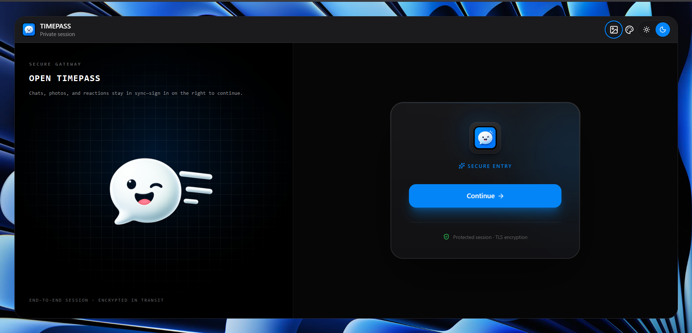
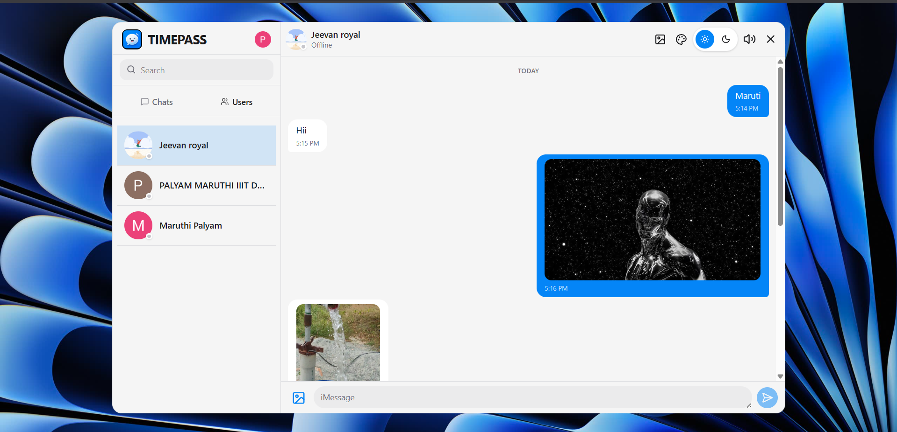
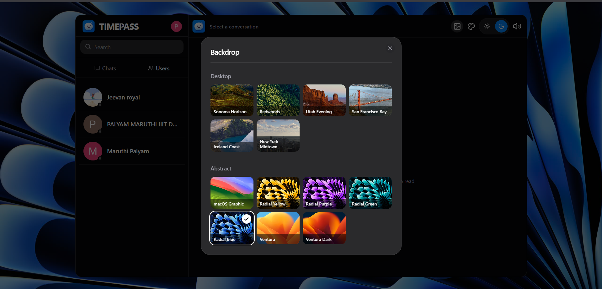
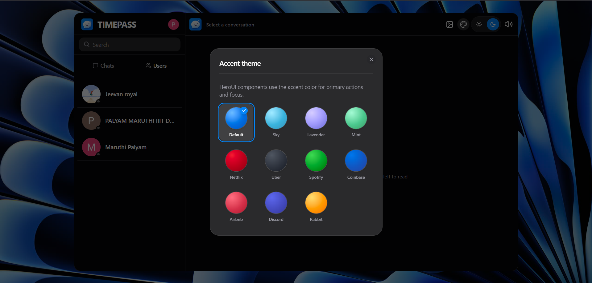
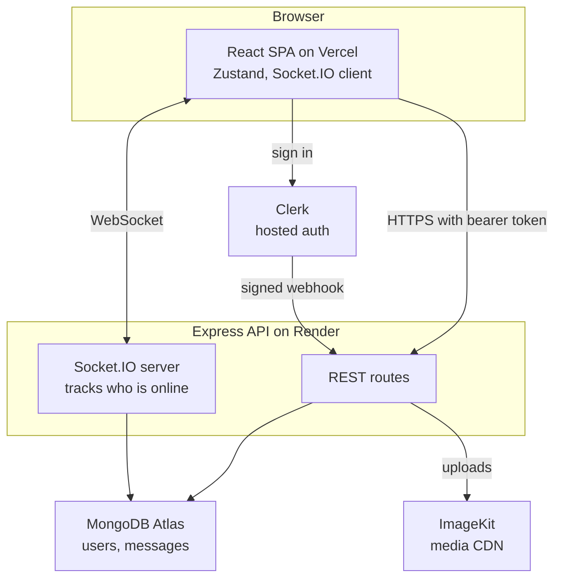

# TIMEPASS

A real-time chat app I built to understand how messaging actually works under the hood — not just the UI, but the WebSocket plumbing, the presence tracking, and the awkward parts nobody mentions in tutorials, like keeping a third-party auth provider in sync with your own database.

It's modelled on iMessage: text, photos, and video, delivered instantly, with themes and wallpapers so it doesn't feel like a form.

[](https://react.dev)
[](https://vite.dev)
[](https://expressjs.com)
[](https://www.mongodb.com/atlas)
[](https://socket.io)
[](https://clerk.com)

**[Try it live](https://timepass-delta-woad.vercel.app)** · [Report a bug](https://github.com/Maruthi14-gif/TIMEPASS/issues) · [Suggest a feature](https://github.com/Maruthi14-gif/TIMEPASS/issues)

---

## Screenshots

| Sign in | Conversations and media |
| :-----: | :---------------------: |
|  |  |

| Wallpapers | Accent themes |
| :--------: | :-----------: |
|  |  |

---

## What it does

- **Instant delivery.** Messages arrive over a persistent WebSocket. No polling, no refresh button.
- **Live presence.** Green dots update the moment someone opens or closes the app.
- **Photos and video** up to 25 MB, served from a CDN rather than my own server.
- **Two-tab sidebar** — recent conversations on one side, everyone on the platform on the other, both searchable.
- **Themes, wallpapers, and keystroke sounds**, saved locally so your setup survives a refresh.
- **Responsive layout** that collapses to a single pane on mobile and expands to two on desktop.

---

## Architecture

Four pieces, each doing one job:



**Sending a message.** The client POSTs to `/api/messages/send/:id`. The server verifies the token, uploads any attachment to ImageKit, saves the message, then looks up the recipient in an in-memory `userSocketMap` and emits `newMessage` straight to their socket if they're online. The sender gets the saved message back in the HTTP response, so they never wait on a round trip.

**Identity lives in two places.** Clerk owns authentication; Mongo owns everything else. A signed webhook upserts the user record on `user.created`, `user.updated`, and `user.deleted`, and `protectRoute` translates the Clerk ID on each token into a Mongo user once, at the edge. Messages only ever reference Mongo `_id`s.

**The frontend and API are on different domains**, so the browser won't send Clerk's session cookie to the API. An Axios interceptor in `frontend/src/lib/axios.js` attaches the session token as a bearer header instead.

Two collections, no `conversations` table — a conversation is just the messages between two people, and the sidebar list is derived with an aggregation that groups by chat partner and sorts by recency. Cheap writes, slightly heavier reads.

One known limit: `userSocketMap` lives in a single process's memory, so presence doesn't survive horizontal scaling. The Socket.IO Redis adapter is first on the roadmap.

---

## Tech stack, and why

**React 19 + Vite** — instant HMR while developing, small bundle at the end.

**Zustand over Redux** — the same global store without the ceremony. `persist` keeps theme and sound settings across reloads for free.

**HeroUI + Tailwind 4** — accessible components I didn't have to build, with the accent color themeable at runtime.

**Clerk** — I didn't want to store password hashes or hand-roll session expiry. The cost is that identity lives outside my database, which is exactly what the webhook above solves.

**Socket.IO over raw WebSockets** — automatic reconnection and transport fallbacks, which I'd otherwise have written badly myself.

**MongoDB + Mongoose** — messages are schema-light and grow fast, and the aggregation pipeline turns "conversations by recency" into one query instead of an N+1 loop.

**Multer memory storage + ImageKit** — uploads stream through the server straight to a CDN and never touch disk. That matters on Render, where the filesystem is wiped on every deploy.

---

## Project structure

```
TIMEPASS/
├── backend/
│   └── src/
│       ├── controllers/      # Request handlers (auth, messages)
│       ├── lib/              # DB, Socket.IO, ImageKit, keep-alive cron
│       ├── middleware/       # protectRoute, Multer upload rules
│       ├── models/           # Mongoose schemas
│       ├── routes/           # Express routers
│       ├── webhooks/         # Clerk webhook verification
│       └── index.js          # Entry point
├── frontend/
│   ├── public/               # Logo, wallpapers, keystroke sounds
│   └── src/
│       ├── components/       # auth/ and chat/ trees
│       ├── context/          # Theme and wallpaper providers
│       ├── hooks/            # useMediaQuery, useKeyboardSound, ...
│       ├── lib/              # Axios instance with the auth interceptor
│       ├── pages/            # AuthPage, ChatPage
│       └── store/            # Zustand stores
└── Dockerfile                # Single-container build
```

---

## Running it locally

You'll need Node 22+, a MongoDB database, a Clerk application, and optionally an ImageKit account for media.

### 1. Install

```bash
git clone https://github.com/Maruthi14-gif/TIMEPASS.git
cd TIMEPASS

cd backend && npm install
cd ../frontend && npm install --legacy-peer-deps
```

### 2. Backend environment

Create `backend/.env`:

```env
PORT=5176
MONGO_URI=mongodb+srv://<user>:<password>@cluster.mongodb.net/timepass
FRONTEND_URL=http://localhost:5173
NODE_ENV=development

CLERK_PUBLISHABLE_KEY=pk_test_...
CLERK_SECRET_KEY=sk_test_...
CLERK_WEBHOOK_SIGNING_SECRET=whsec_...

IMAGEKIT_PRIVATE_KEY=private_...
```

| Variable | Required | Notes |
| --- | :---: | --- |
| `MONGO_URI` | Yes | Connection string. |
| `FRONTEND_URL` | Yes | Exact client origin. Controls CORS **and** the Socket.IO allowed origin. No trailing slash. |
| `CLERK_SECRET_KEY` | Yes | Verifies session tokens server-side. |
| `CLERK_WEBHOOK_SIGNING_SECRET` | Yes | Without it the webhook returns 503 and nobody ever syncs to Mongo. |
| `PORT` | No | Hosts like Render inject this. |
| `NODE_ENV` | No | Set `production` to enable the keep-alive cron. |
| `IMAGEKIT_PRIVATE_KEY` | No | Leave it out to run text-only; uploads then fail with a clear 500. |

### 3. Frontend environment

Create `frontend/.env`:

```env
VITE_API_URL=http://localhost:5176/api
VITE_CLERK_PUBLISHABLE_KEY=pk_test_...
```

> Vite inlines `VITE_*` variables at **build time**, not runtime. Change either one and you need a full dev-server restart locally, or a fresh deployment in production. `VITE_API_URL` must end in `/api` with no trailing slash.

### 4. Wire up the Clerk webhook

Skip this and nothing will work — see the sync diagram above.

1. Clerk Dashboard → **Webhooks → Add Endpoint**
2. URL: `https://<your-api-host>/api/webhooks/clerk`
3. Subscribe to `user.created`, `user.updated`, `user.deleted`
4. Copy the signing secret into `CLERK_WEBHOOK_SIGNING_SECRET`

Locally, expose the API with `ngrok http 5176` and use the tunnel URL.

### 5. Start both halves

```bash
cd backend && npm run dev     # http://localhost:5176
cd frontend && npm run dev    # http://localhost:5173
```

Sign in with two different accounts in two browsers to watch presence and live delivery work.

---

## API reference

Everything is under `/api`. All routes except the webhook and health check need `Authorization: Bearer <clerk-token>`.

| Method | Endpoint | What it does |
| --- | --- | --- |
| `GET` | `/health` | Liveness probe. Returns `{ ok: true }`. |
| `GET` | `/api/auth/check` | The caller's Mongo user document. |
| `GET` | `/api/messages/users` | Everyone except the caller. |
| `GET` | `/api/messages/conversations` | Chat partners, most recent first. |
| `GET` | `/api/messages/:id` | Full history with one user, oldest first. |
| `POST` | `/api/messages/send/:id` | JSON `{ text }`, or multipart with a `media` field. |
| `POST` | `/api/webhooks/clerk` | Signed user-lifecycle events. Raw body, no JSON parsing. |

### Socket events

| Event | Direction | Payload |
| --- | --- | --- |
| `connection` | Client → Server | `userId` in the handshake query |
| `getOnlineUsers` | Server → Client | Array of online user IDs, broadcast on every connect and disconnect |
| `newMessage` | Server → Client | The saved message, emitted only to the recipient's socket |

---

## Deployment

**Frontend on Vercel.** Root directory `frontend`. Add `VITE_API_URL` and `VITE_CLERK_PUBLISHABLE_KEY` *before* the first build. Live at [timepass-delta-woad.vercel.app](https://timepass-delta-woad.vercel.app).

**Backend on Render.** Root directory `backend`, build `npm install`, start `npm start`. Add every backend variable above, and set `FRONTEND_URL` to the exact Vercel URL.

**Or one container.** The `Dockerfile` builds both halves into a single image where Express serves the compiled SPA from `public/` and the client calls `/api` on its own origin — no cross-domain token juggling at all.

```bash
docker build --build-arg VITE_CLERK_PUBLISHABLE_KEY=pk_test_... -t timepass .
docker run -p 3001:3001 --env-file backend/.env timepass
```

---

## Troubleshooting

Every one of these bit me at some point.

| Symptom | Cause |
| --- | --- |
| `401` on every request | The bearer token isn't reaching the API. Check the Axios interceptor and `CLERK_SECRET_KEY`. |
| `404 User profile is not synced yet` | The Clerk webhook isn't configured, or its signing secret is wrong. |
| Empty user list, requests 404 | `VITE_API_URL` unset or missing `/api`, so calls hit the static host instead of the API. |
| CORS error in the console | `FRONTEND_URL` doesn't exactly match the client origin. |
| Upload returns 500 | `IMAGEKIT_PRIVATE_KEY` isn't set. |
| First request after idle hangs | Free-tier hosts sleep. Set `NODE_ENV=production` for the 14-minute keep-alive ping. |

---

## What's next

- [ ] Redis adapter so Socket.IO works across multiple server instances
- [ ] Group conversations
- [ ] Typing indicators and read receipts
- [ ] Editing and deleting messages
- [ ] Push notifications
- [ ] Full-text message search
- [ ] Swap to production Clerk keys

---

## License

ISC.

Built with [Clerk](https://clerk.com), [HeroUI](https://www.heroui.com), [ImageKit](https://imagekit.io), and [Socket.IO](https://socket.io).
